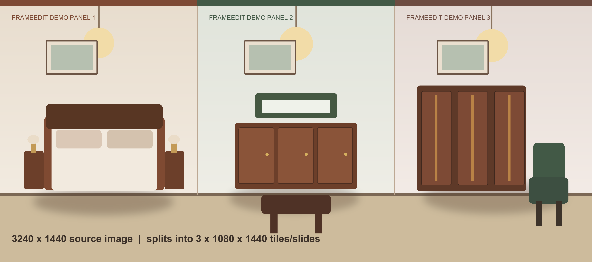
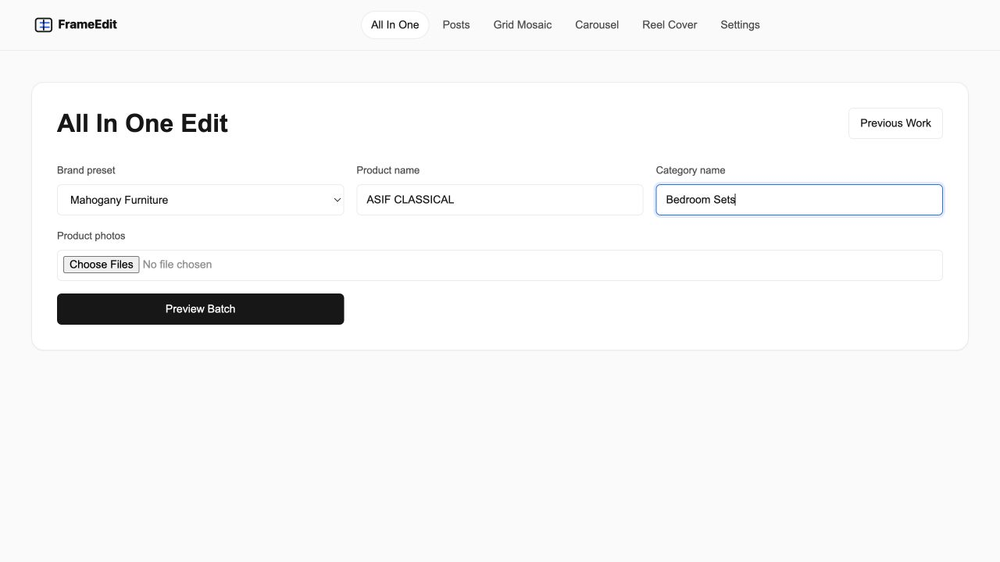
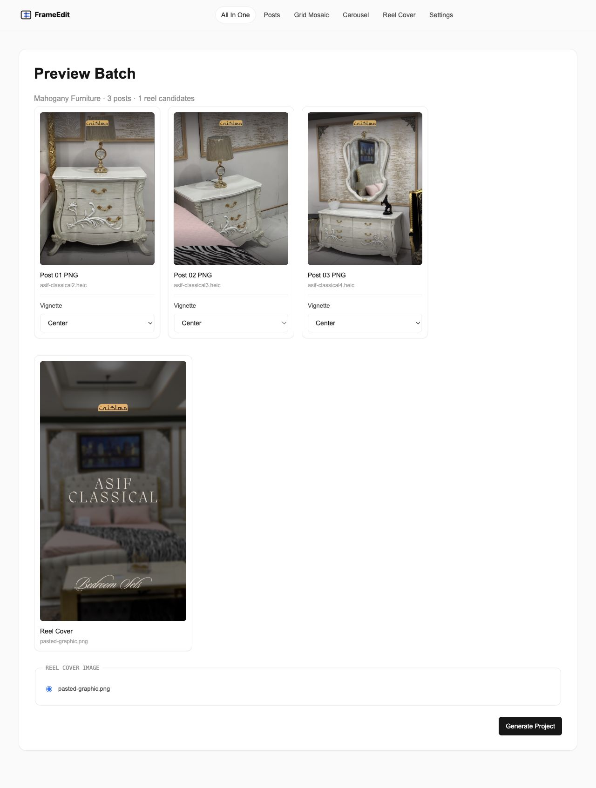
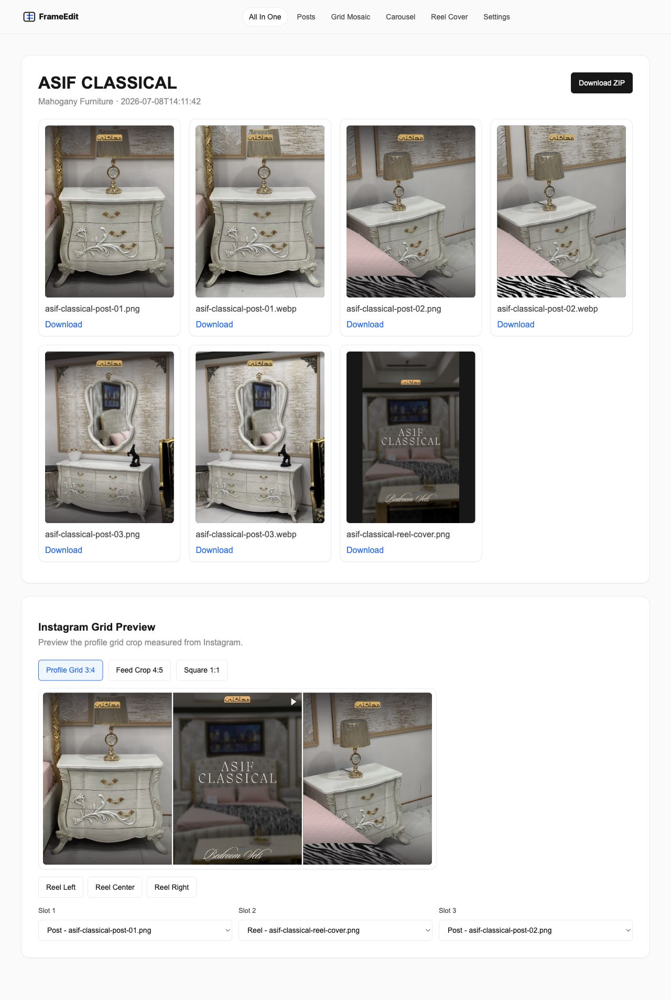
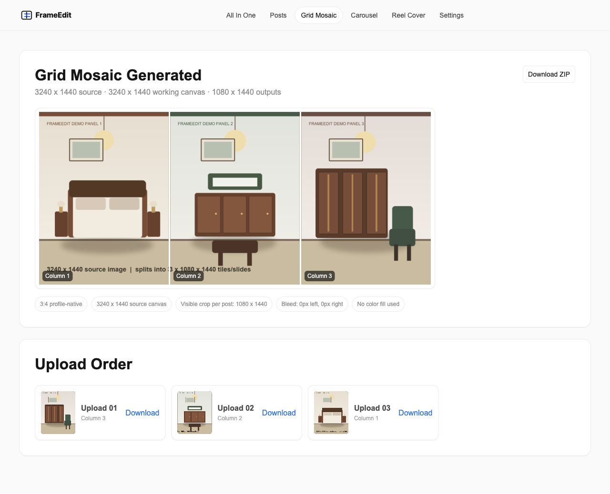
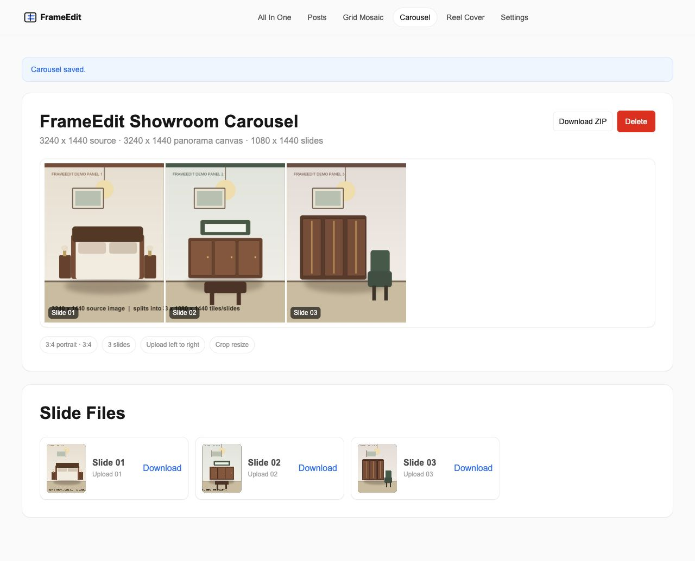

# FrameEdit Demo Walkthrough

This walkthrough shows FrameEdit across the main production paths that matter for an Instagram content workflow.

The demo uses two source sets:

- A real Mahogany Furniture batch for the All In One flow: three supported `3:4` product photos plus one `9:16` reel-cover image.
- A generated showroom panorama for Grid Mosaic and Carousel: `3240 x 1440`, which splits exactly into three `1080 x 1440` vertical outputs.

The standalone Posts and Reel Cover tabs use the same generation engine shown inside All In One, so this walkthrough does not duplicate them. The dedicated demos below focus on the tabs that solve different production problems: profile mosaics and panorama carousels.

## Demo Source For Grid And Carousel

The generated source image is intentionally exact-ratio, not approximate.



- Source canvas: `3240 x 1440`
- Aspect ratio: `9:4`
- Grid output: three `1080 x 1440` profile-native tiles
- Carousel output: three `1080 x 1440` portrait slides

## 1. Start The All In One Batch

Choose the brand preset, enter the product/category text, and upload the product images.



For this demo:

- Brand preset: `Mahogany Furniture`
- Product name: `ASIF CLASSICAL`
- Category name: `Bedroom Sets`
- Source images: three `3:4` post photos and one `9:16` reel-cover image

## 2. Preview Before Generating

FrameEdit previews the post and reel-cover outputs before writing the final project. Each post can use a center, top, or bottom vignette.



This step is where a content operator can catch the common manual-production mistakes:

- Wrong image ratio
- Wrong reel-cover candidate
- Incorrect vignette position
- Missing brand/logo layer
- Product/category text issues

## 3. Generate The Saved Project

After preview, FrameEdit saves a permanent project with grouped outputs and a ZIP download.



The saved project contains:

```text
posts_instagram/
  asif-classical-post-01.png
  asif-classical-post-02.png
  asif-classical-post-03.png

posts_webp_no_vignette/
  asif-classical-post-01.webp
  asif-classical-post-02.webp
  asif-classical-post-03.webp

reel_cover/
  asif-classical-reel-cover.png

asif-classical-mahogany-furniture.zip
project.yaml
```

FrameEdit also shows an Instagram Grid Preview so the operator can check how post and reel-cover tiles sit together in a profile row.

## 4. Generate A Profile Grid Mosaic

The Grid Mosaic tab solves a different pain point: turning one wide layout into individual profile tiles without hand-slicing, mis-ordering columns, or exporting the wrong dimensions.



For this demo:

- Source image: `3240 x 1440`
- Tile format: `3:4 profile-native`
- Output tiles: three `1080 x 1440` PNG files
- Upload order: right-to-left so the Instagram profile row reconstructs correctly after posting
- ZIP: generated automatically with the split tiles

## 5. Generate A Panorama Carousel

The Carousel tab takes the same exact-ratio source and turns it into swipeable slides. This prevents the common carousel mistakes: uneven crops, inconsistent slide dimensions, and manually named files.



For this demo:

- Source image: `3240 x 1440`
- Slide count: `3`
- Slide format: `3:4 portrait`
- Output slides: three `1080 x 1440` PNG files
- Upload order: left-to-right
- ZIP: generated automatically with the saved carousel project

## Why This Matters

FrameEdit replaces repetitive design production with a repeatable local workflow:

- Product photos become exact-size Instagram post exports.
- Reel covers use consistent brand typography, overlay, blur, and logo placement.
- Profile mosaics are split into correctly ordered tiles.
- Panorama carousels are split into exact-ratio slides.
- WebP variants are created automatically where needed.
- Final files are grouped, named, and zipped without manual folder cleanup.
- The same engine supports both CLI and Web UI workflows.
